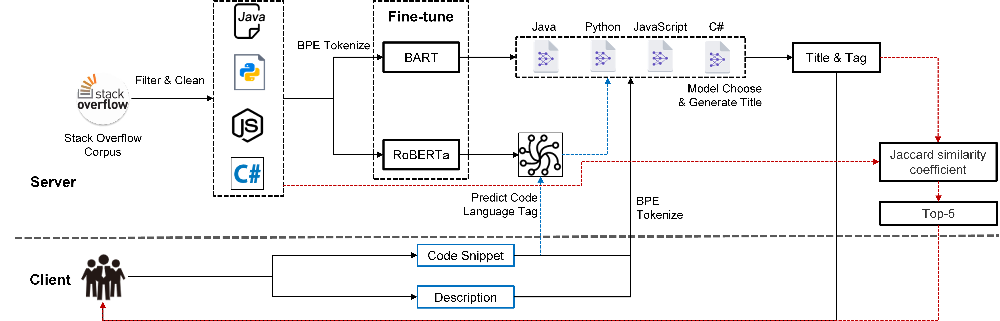
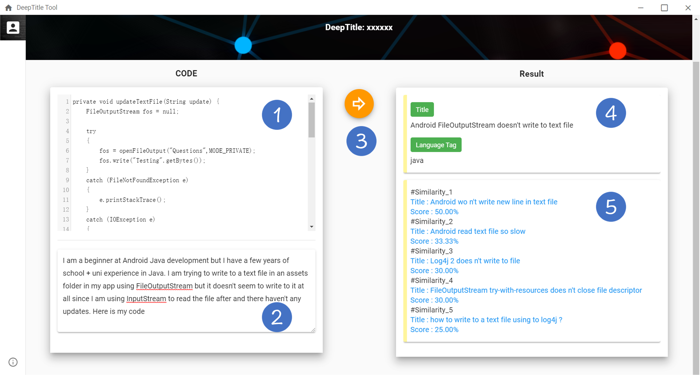
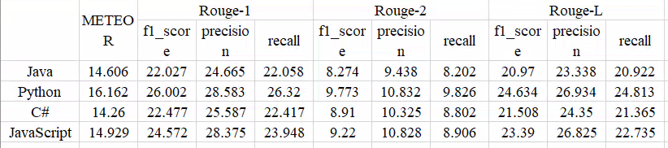

# SOTG
SOTG: A Tool for Stack Overflow Title Automatic Generation

# Frame Work

# Home Page

# Installation & User Interface

## Installation 

Download link: https://github.com/NTDXYG/SOTG/releases

Then select the installation directory and proceed with the regular installation.

## User Interface

When the program is running, select the localhost service or Internet service to enter the application.

To use the tool, the user needs to enter the code snippet of the related problem in ①, enter the detailed description of the related problem in ②, and press the Generate button ③. Then SOTG displays a progress bar and processes tasks in the background. The finally generated Title and Code Language Tag are displayed in ④, and a list of posts similar to the question will be returned at ⑤.

# EVALUATION

## Qualitative Analysis

# To be continued